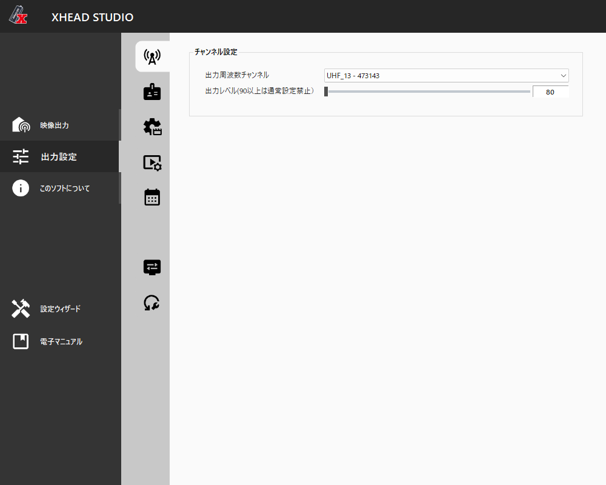

# XHEAD-USB 解析プロジェクト

マイコンソフト製の超小型USB接続OFDM変調器「[XHEAD-USB](https://www.micomsoft.co.jp/xhead-usb.html)」を対象に、以下を行うプロジェクトである。

- 公式アプリ「XHEAD-STUDIO」の挙動・通信プロトコルの解析
- 公式アプリより自由度の高い設定を行える独自送出ツールの開発
- 実機の解析結果・手法のドキュメント化

## ステータス

| 項目 | 状態 | 詳細 |
|---|---|---|
| アーキテクチャ解析（GUI⇔サービス、gRPC構成） | 完了 | [docs/architecture.md](docs/architecture.md) |
| 隠しDebugモード (`EnableDebugMode`) の発見・有効化 | 完了 | [docs/architecture.md](docs/architecture.md)・[docs/gui_debug_mode_comparison.md](docs/gui_debug_mode_comparison.md) |
| USBドライバ不具合の原因診断・修正 | 完了 | [docs/architecture.md](docs/architecture.md) §5 |
| gRPCプロトコルの完全再構成（`.proto`、DLL非依存で再実装可能） | 完了 | [docs/protocol/README.md](docs/protocol/README.md) |
| 実機からの変調パラメータ確定（FieldID・許容値） | 完了 | [docs/protocol/modulation_capabilities.md](docs/protocol/modulation_capabilities.md) |
| 独自送出ツール: 読み取り（プロパティツリーのダンプ） | 完了 | `tools/custom_sender` |
| 独自送出ツール: 書き込み（`CmdChannelStart`経由でのSet） | 完了 | `ChannelOpen`→`ProgramAdd/Commit`→**`ChannelStart`(Source構築前・全プロパティ群込み)**→`Source`構築→`ProgramApply`→`SourceStart`という正しいアーキテクチャを特定。値の変更（Constellation・RF電力のPAGain/DACGain）が実際に物理層まで反映されることもネイティブログで実証済み |
| RTL-SDRループバックでの実信号検証 | 完了 | [tools/rtlsdr_analysis](tools/rtlsdr_analysis) — 送出前後で470〜476MHz帯（6MHz幅、ISDB-Tの帯域幅と一致）に約38dBのパワー上昇を実測、送出停止で消失することも確認。設定した中心周波数473MHzとも一致 |
| `mnservice.exe`ネイティブ側の生USBプロトコル解析 | 検証中 | [tools/usb_capture](tools/usb_capture) — バルク転送(24064バイト=MPEG-TS 188バイト×128、224スライスのリングバッファ)の生TSフレーミングを確認。コントロール転送は`mhal_modulation.cc`が使う「アドレス設定→データ読み書き」の汎用レジスタバスと判明。**ISDB-T変調パラメータ（Frequency/Bandwidth/Constellation/FFT/CodeRate/GuardInterval/TimeInterleavce）のレジスタアドレスをほぼ完全にマップ化**、DACGainも確定。フルライフサイクルキャプチャで新たに`0x0020`台（デバイス識別情報）を発見、`0x0629`はリングバッファ占有量ステータスの可能性が高いと判明。PAGainの送信先とバルク転送ヘッダは未解読 |
| `mnservice.exe`を介さない直接制御（DLL/サービス完全非依存） | **完了・RF出力まで実証** | [tools/direct_usb](tools/direct_usb) — WinUSBで実機に直接接続し、解読したレジスタバスで読み書きを実証。`CmdChannelStart`相当のフル設定シーケンスを`--configure`で再現し、`mnservice.exe`を一切起動しない状態で変調器を駆動、RTL-SDRループバックで**実際にRF電力上昇（+33〜34dB、2回のスキャンで再現）を確認**——vendor DLL・公式サービス非依存の自前実装がRF出力まで到達したプロジェクトの集大成 |

## クイックリンク

- **解析ドキュメント**
  - [docs/architecture.md](docs/architecture.md) — 全体アーキテクチャ、EnableDebugModeの発見、USBドライバ問題、検討した代替アプローチ
  - [docs/protocol/README.md](docs/protocol/README.md) — gRPCプロトコルの完全リファレンス（`.proto`群 + 解説）
  - [docs/protocol/modulation_capabilities.md](docs/protocol/modulation_capabilities.md) — 実機検証済みの変調パラメータ一覧、Set経路の調査結果
  - [docs/gui_debug_mode_comparison.md](docs/gui_debug_mode_comparison.md) — 通常時/Debug有効時のGUIスクリーンショット比較
- **ツール**
  - [tools/custom_sender](tools/custom_sender) — 独自送出ツール（C#、`mnservice.exe`経由）
  - [tools/direct_usb](tools/direct_usb) — `mnservice.exe`を介さずWinUSBで実機に直接読み書きする診断ツール（C#）
  - [tools/native_analysis](tools/native_analysis) — Ghidra/cdbによる`mnservice.exe`動的解析スクリプト・手順
  - [tools/usb_capture](tools/usb_capture) — USBプロトコル解析メモ
  - [tools/rtlsdr_analysis](tools/rtlsdr_analysis) — RTL-SDRループバック検証メモ

## 主要な発見

XHEAD-STUDIOは **GUI (`xhead_studio.exe`)** と **バックグラウンドサービス (`service\mnservice.exe`)** の2プロセス構成で、両者は `localhost:50051` の **gRPC** で通信する。実機とのUSB通信は `mnservice.exe`（ネイティブバイナリ）が担当する。

最大の発見は、GUI側に **`EnableDebugMode` という隠しフラグ** が存在し、これを有効にすると変調パラメータ（Constellation / CodeRate / GuardInterval / FFT / TimeInterleave 等）をはじめ、映像・音声・コーデックの詳細設定が公式GUI上に解放される点である。このフラグは設定ファイル保存時には書き出されない仕様だが、設定ファイルを直接編集すれば有効化できる。

<p align="center">
  
  
  <br><sub>左: 通常時／右: EnableDebugMode有効時（変調設定タブ）</sub>
</p>

さらに、GUI⇔サービス間の通信は固定メッセージではなく汎用的なプロパティツリー方式であり、公式GUIが一切参照していない設定項目がサービス側に存在する。実機から読み出した変調パラメータの完全なFieldID一覧は [docs/protocol/modulation_capabilities.md](docs/protocol/modulation_capabilities.md) にまとめてあり、ISDB-T以外にDVB-T2/ATSC/DTMB等のサブ構造体まで存在することが判明している（変調チップ自体は多規格対応の可能性が高い）。`tools/custom_sender` はこのサービスに直接接続し、公式GUIの制限を経由せずフル機能へアクセスすることを目指す独自クライアントである。

送出（Set）経路は当初`CmdProgramApply`が謎の`bad status`エラーで止まっていたが、Ghidra・cdbによるネイティブ動的解析の末に真因（エンコーダオブジェクトの未初期化）を特定し、さらに`CmdChannelStart`はSourceが一切存在しない段階で一度だけ呼ぶ「変調器・エンコーダの電源投入」操作であり、`CmdProgramApply`／`CmdSourceStart`はその後で「稼働中のパイプラインに実ソースを繋ぐ」別の後段ステップである、という公式アプリの実際のアーキテクチャを特定した。この順序と必須プロパティ群を揃えたところ送出パイプライン全体が動作した（詳細は [docs/protocol/modulation_capabilities.md](docs/protocol/modulation_capabilities.md) の「続報3・4」）。

## ディレクトリ構成

```
docs/                          解析ドキュメント
  architecture.md               XHEAD-STUDIOの全体アーキテクチャ、隠しDebugモードの発見など
  gui_debug_mode_comparison.md  通常時/Debug有効時のGUIスクリーンショット比較
  protocol/                     gRPCプロトコルのリファレンス実装非依存な再構成 (.proto + 解説)
    modulation_capabilities.md   実機で確認した変調パラメータの実際の姿(FieldID等)
  screenshots/                  上記ドキュメントで使用するスクリーンショット
tools/
  custom_sender/        独自送出ツール (C#, mnClientDotNet.dll を参照して mnservice.exe に直接接続)
  usb_capture/           USBプロトコル解析用スクリプト・メモ (USBPcap/Wireshark)
  rtlsdr_analysis/       RTL-SDRループバックによる実信号検証スクリプト
captures/              実機キャプチャデータ（大容量のためリポジトリには含めない。.gitignore参照）
decompiled/            公式アプリのデコンパイル結果（著作権上リポジトリには含めない。ローカル専用）
```

## 検証環境

- XHEAD-USB 実機 + PC(Windows)をUSB接続
- XHEAD-USBのRF出力(同軸)を、SMA変換コネクタ経由でRTL-SDRの入力にループバック接続
  （電波を実際に空中線から放射せず、有線ループバックで送出信号を安全に受信・解析する構成）

## 独自送出ツール (tools/custom_sender)

C#製。公式インストール済みの `mnClientDotNet.dll` を参照して `mnservice.exe` (localhost:50051) に直接 gRPC接続する。**vendor DLLはリポジトリに含めず**、ローカルの `C:\Program Files\Micomsoft\XHEAD-STUDIO` を参照する前提。

```
cd tools/custom_sender
dotnet build
# XHEAD-STUDIO (xhead_studio.exe) を一度起動してサービスを立ち上げた状態で:
dotnet run
```

## 免責・注意事項

- 本プロジェクトは、購入済み実機の相互運用性向上・自由度拡張を目的とした解析であり、第三者のシステムへの攻撃等は目的としていない。
- 電波法上、実際に電波を空中線から発射する場合は、出力・帯域外輻射等の技術基準を満たす必要がある。本プロジェクトの検証は基本的にRTL-SDRへの同軸ループバックで行っており、実際の運用（アンテナ接続・電波発射）を行う場合は自己責任で関連法令を確認すること。
