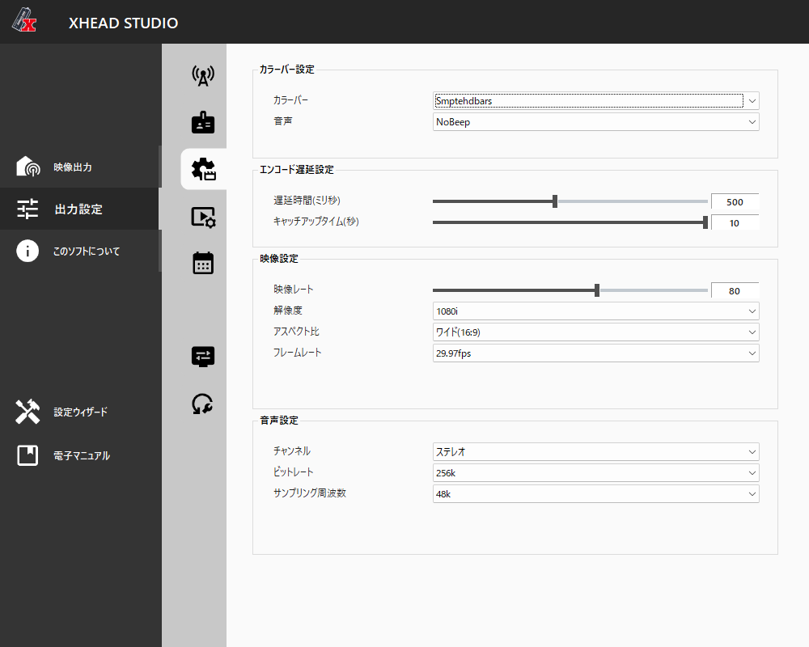
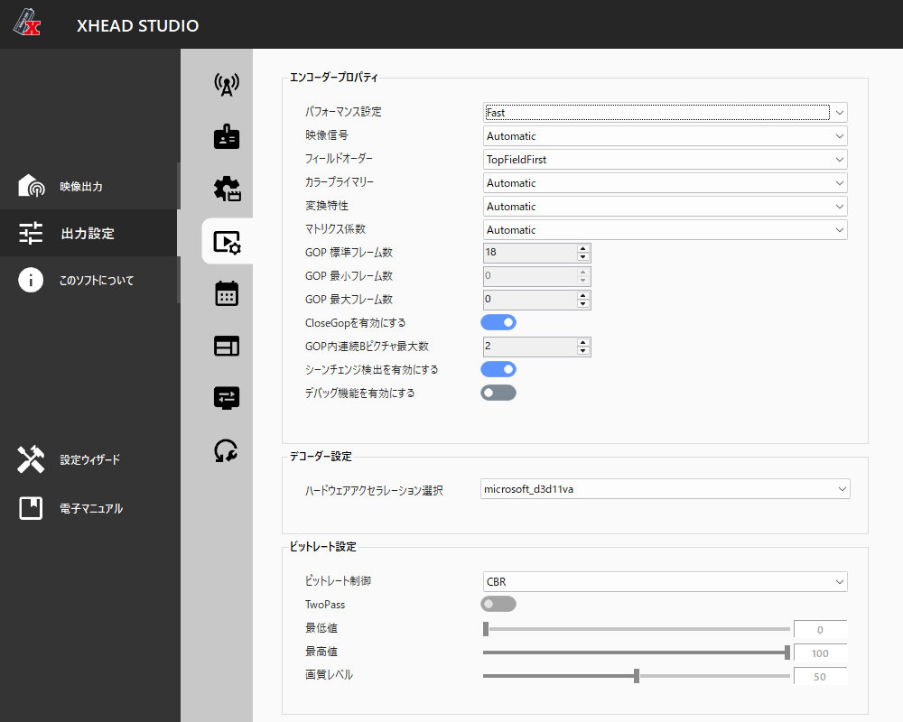
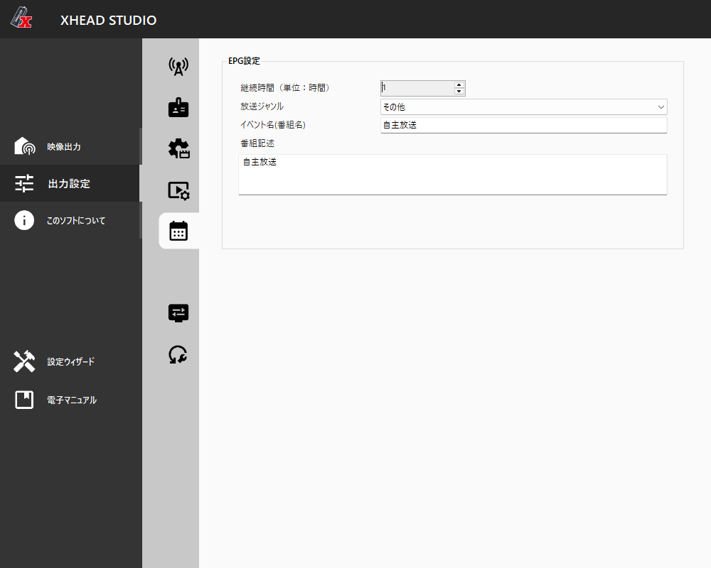
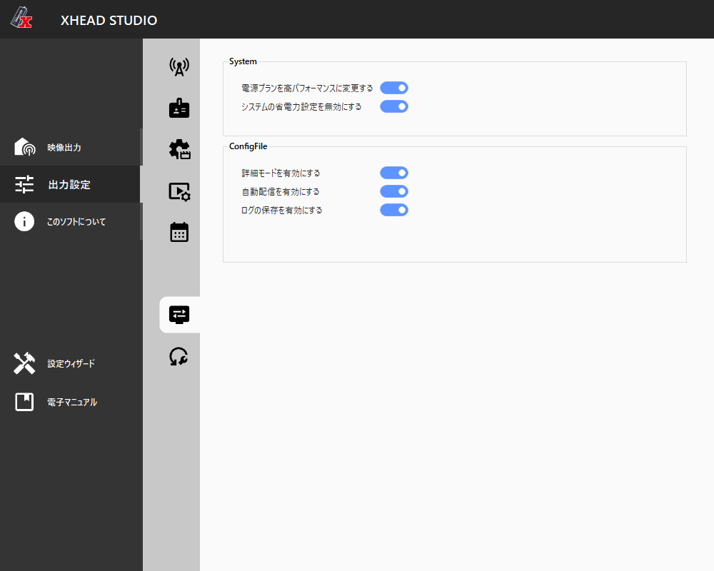

# GUI: 通常時 vs EnableDebugMode有効時 のスクリーンショット比較

`EnableDebugMode` (`docs/architecture.md` §3) を設定ファイル編集で有効化した際に、実際に
XHEAD-STUDIOのGUIがどう変化するかを実機で記録したもの。すべて `出力設定` タブ配下の
各サブタブ。左が通常時 (`docs/screenshots/normal/`)、右が対応するDebug有効時
(`docs/screenshots/debug/`)。

## 01. 変調設定 (アンテナアイコン)

| 通常時 | Debug有効時 |
|---|---|
|  |  |

出力周波数チャンネル・出力レベルのみ → **キャリア変調方式・内符号符号化率・ガードインターバル・
高速フーリエ変換・時間インターリーブ** が追加。`docs/protocol/modulation_capabilities.md` の
`mModulationParam.Mode(ISDB_T)` サブ構造体 (Constellation/CodeRate/GuardInterval/FFT/
TimeInterleavce, FieldID 19-24) と1対1で対応。

## 02. チャンネル設定

| 通常時 | Debug有効時 |
|---|---|
|  |  |

**PCR PID・PMT PID** (16進入力, 既定 0x0100/0x0101) が追加。`mMTSProgramParam.PCR_PID`/
`PMT_PID` (FieldID 0/1) に対応。

## 03. メディア設定

| 通常時 | Debug有効時 |
|---|---|
|  |  |

**Video PID・Audio PID** (16進入力, 既定 0x0110/0x0120) が追加。`mPSEncodeParam.VIDEO_PID`/
`AUDIO_PID` に対応。

## 04. コーデック設定

| 通常時 | Debug有効時 |
|---|---|
|  |  |

見た目上の差分なし。GOP詳細設定や「デバッグ機能を有効にする」トグル自体は、既存の設定ファイルで
`System.EnableAdvanceMode: true` が先に有効だったため、通常時から既に表示されていた
（`EnableAdvanceMode`はDebugモードとは別の既存フラグ）。

## 05. EPG設定

| 通常時 | Debug有効時 |
|---|---|
|  |  |

**Event ID** (16進入力, 既定 0x1100) が追加。`mEPGSimpleParam.EventID` に対応。

## 06. システム設定

| 通常時 | Debug有効時 |
|---|---|
|  |  |

見た目上の差分なし。`EnableDebugMode` 自体はGUIのどこにも露出しない設計であることの裏付け
（`xHeadConfig.cs`の`IgnorePropertiesResolver`で保存時に除外される仕様と一致）。

## 07. BML (Debug有効時のみ出現する新規タブ)

| Debug有効時 |
|---|
|  |

通常時はサイドバーのアイコン自体が存在しない。PID・コンポーネント・ビットレートの一覧UI。
`xhead_usb.ui.config/uiBML.cs`, `xhead_usb.config/xBMLFile.cs`（`EnableBML`フラグ配下）に対応。
XHEAD-2のUSBマスストレージ経由BML転送 (`XHEAD-2_BML_USB.pdf`) とは異なり、XHEAD-USBでは
GUI上のこのテーブルにPID/コンポーネント/ビットレートを直接入力する方式と見られる（未検証）。

## まとめ

`EnableDebugMode`が実際に解放するのは、確認できた範囲では以下の5箇所:

1. 変調パラメータのフル項目（Constellation/CodeRate/GuardInterval/FFT/TimeInterleave）
2. PCR/PMT PID の直接指定
3. Video/Audio PID の直接指定
4. EPGのEvent ID直接指定
5. BMLタブそのものの出現（`EnableBML`と連動）

いずれも「GUIが元々内部で持っているが表示していなかった値」であり、`docs/protocol/`のプロパティ
ツリー解析結果（`mnservice.exe`側は最初からこれら全フィールドを公開している）と矛盾しない。
